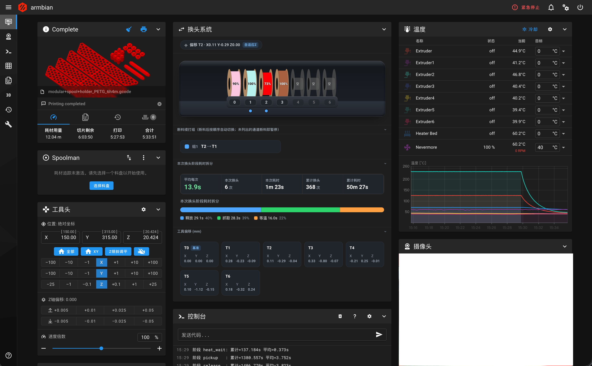
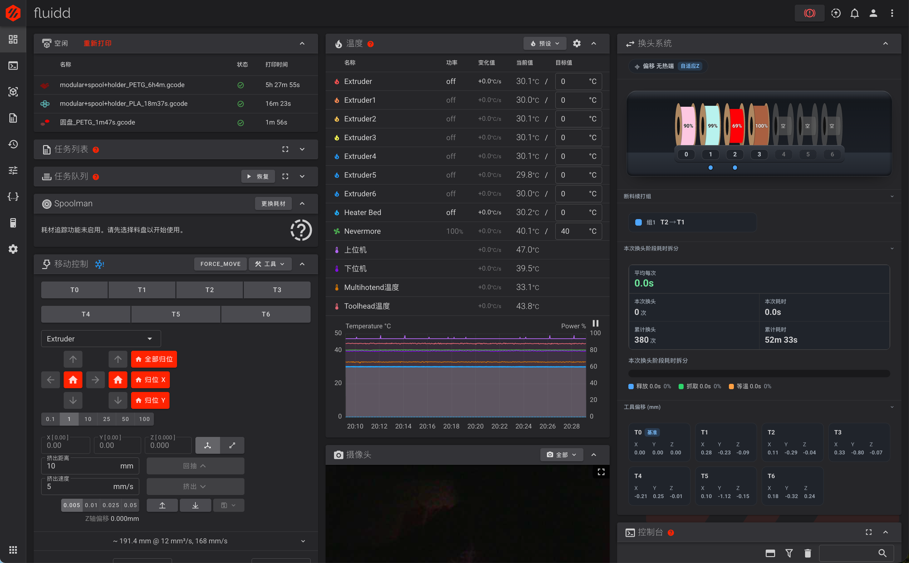

# klipper-toolchange-stats

这是一个 Klipper 多热端 / 多工具头换头插件。它负责注册 `T0`、`T1` 这类换头命令，并在换头时自动处理当前工具状态、偏移、温度等待、耗材检查、断料续打、换头统计等流程。

配合 [mainsail-toolchanger](https://github.com/null01024/mainsail-toolchanger) / [fluidd-toolchange](https://github.com/null01024/fluidd-toolchanger) 网页前端后，可以在 Mainsail / Fluidd 中直观看到多工具头状态、耗材状态和换头统计：





这份 README 面向第一次安装的用户，重点说明怎么安装、安装后要改哪些配置、怎么验证能不能正常工作。

## 适合谁使用

适合：

- Klipper 多热端机器。
- Klipper 多工具头机器。
- 希望用 `T0`、`T1`、`T2` 等命令切换工具。
- 希望把换头流程、偏移、耗材检测、断料续打、统计集中到插件里管理。

不适合：

- 普通单热端机器。
- 还没有完成基础 Klipper 配置、不能正常归零和加热的机器。

## 安装前准备

你需要先有：

- 已安装并能正常启动的 Klipper。
- 已配置好的 `printer.cfg`。
- 能 SSH 登录打印机。
- 普通用户权限，不要用 root 运行安装脚本。

插件默认会安装到：

```text
~/klipper-toolchange-stats
```

配置默认会放到：

```text
~/printer_data/config/multitool/
```

安装脚本会自动在 `printer.cfg` 顶部加入：

```ini
[include multitool/*.cfg]
```

## 一键安装

在 SSH 终端执行：

```bash
wget -O - https://raw.githubusercontent.com/null01024/klipper-toolchange-stats/main/install.sh | bash
```

GitHub 访问不稳定时可以使用代理：

```bash
GH_PROXY=https://v6.gh-proxy.org/ wget -O - https://v6.gh-proxy.org/https://raw.githubusercontent.com/null01024/klipper-toolchange-stats/main/install.sh | GH_PROXY=https://v6.gh-proxy.org/ bash
```

也可以手动安装：

```bash
git clone https://github.com/null01024/klipper-toolchange-stats ~/klipper-toolchange-stats
cd ~/klipper-toolchange-stats
bash install.sh
```

## 安装脚本会问什么

脚本启动后会先问：

```text
是否为新安装？新安装会生成 multitool/multihotend.cfg [y/N]:
```

直接回车或输入 `n`：

- 按升级处理。
- 不生成 `multihotend.cfg`。
- 不复制 CxChanger 换头路径模板。
- 不覆盖已有配置。

输入 `y`：

- 进入新安装流程。
- 生成 `multihotend.cfg`。
- 可选择换头方案。
- 输入的热端数量会自动同步到 `multitool_config.cfg` 和所选对刀配置。
- 如果选择 CxChanger，还会自动同步 `change_tool.cfg` 中 `t0..tN` 的 dock 坐标变量数量。

随后会问：

```text
请选择对刀方案：
  0) 无对刀：不安装对刀插件，不部署对刀配置。
  1) 微动对刀：安装 tools_calibrate.py，并部署 calibration.cfg。
  2) 涡流对刀：安装 tool_eddy_calibration.py，并部署 calibration-eddy.cfg。
```

微动和涡流对刀脚本不会放入本仓库，安装时按选择从上游仓库下载。

随后会问：

```text
请选择是否安装/更新配套前端：
  0. 不安装/更新前端
  1. Fluidd
  2. Mainsail（维护可能不及时）
请输入 0,1,2 [0]:
```

直接回车或输入 `0`：

- 只安装 / 更新 Klipper 插件。

输入 `1`：

- 插件安装完成后，会自动调用 `install_toolchanger_stack.sh`。
- 脚本会检查已有 Fluidd 前端，并安装 / 更新 `fluidd-toolchanger`。
- 会更新 Moonraker 的 Fluidd 前端 update_manager 配置。

输入 `2`：

- 插件安装完成后，会自动调用 `install_toolchanger_stack.sh`。
- 脚本会检查已有 Mainsail 前端，并安装 / 更新 `mainsail-toolchanger`。
- 注意：Mainsail 版本维护可能不及时。
- 会更新 Moonraker 的 Mainsail 前端 update_manager 配置。

### 换头方案

新安装时会继续询问：

```text
请选择换头方案：
  0) 自定义：自定义换头/换热端移动路径。
  1) CxChanger：https://github.com/cx330-TXY/CxChanger
```

选择 `0` 自定义：

- 不复制 `change_tool.cfg`。
- 不修改换头钩子。
- 你需要自己实现 `multitool_release_tool` 和 `multitool_pickup_tool`。
- 生成 `multihotend.cfg` 时会继续询问硬件模式。

选择 `1` CxChanger：

- 使用 `schemes/CxChanger/change_tool.cfg` 模板。
- 模板会复制到 `~/printer_data/config/multitool/change_tool.cfg`。
- 安装脚本会自动把 `multitool_config.cfg` 的两个换头钩子改为调用 `_release_tool` / `_pickup_tool`。
- 安装脚本会按输入的热端数量补齐或裁剪 `_multitool_cfg` 中的 `variable_tN_dock_x/y`。
- CxChanger 固定按“多热端复用一个挤出机步进”的模式生成 `multihotend.cfg`。

### 硬件模式

只有选择自定义方案时才会询问硬件模式：

```text
请选择硬件模式：
  1) 多热端：多个热端复用一个挤出机步进（默认）
  2) 多工具头：每个工具头都有独立挤出机步进
```

多热端模式：

- `T0 -> [extruder]`，包含完整挤出机步进和温控配置。
- `T1..Tn -> [extruder1]..[extruderN]`，只包含温控配置。
- `[multitool] sync_extruder_motion` 通常保持 `True`。

多工具头模式：

- 每个 `extruder` 都生成完整 `step_pin`、`dir_pin`、`enable_pin`、`rotation_distance`、温控配置。
- 每个 `extruder` 都生成对应 `[tmc2209 extruder...]` 模板。
- 停靠坞风扇固定为逐工具模式，每个 `extruder` 一个 `dock_fan`，不会再询问共享风扇模式。
- 需要在 `[multitool]` 中设置：

```ini
sync_extruder_motion: False
```

### 停靠坞风扇模式

新安装生成 `multihotend.cfg` 时，如果是多热端模式，会继续询问：

```text
请选择 dock_fan 模式：
  1) 一个共享 dock_fan 监听所有 extruder（默认）
  2) 每个 extruder 一个 dock_fan
```

如果是多工具头模式，脚本会固定使用逐工具模式，不会询问这个选项。

共享模式会生成一个：

```ini
[heater_fan dock_fan]
heater: extruder, extruder1, extruder2, ...
```

逐工具模式会生成：

```ini
[heater_fan dock_fan_t0]
[heater_fan dock_fan_t1]
...
```

## 安装后必须修改的文件

安装完成后不要急着打印。先按下面顺序检查配置。

### 1. multitool_config.cfg

路径：

```text
~/printer_data/config/multitool/multitool_config.cfg
```

重点检查 `[multitool]`：

```ini
[multitool]
tool_count: 4
z_hop: 0.4
feed_z: 600
accel_swap: 8000
untool_safe_z: 10
untool_unhomed_prepare: True
sync_active_spool: True
sync_active_extruder: True
sync_extruder_motion: True
extruder_motion_sync_stepper: extruder
default_pressure_advance_extruder: extruder
extrude_compensation_length: 0.0
extrude_compensation_speed: 1800
```

常见修改：

- `tool_count`：新安装时脚本会按输入的热端数量自动设置，后续改数量时需要同步修改。
- `z_hop`：换头前抬 Z 高度。
- `accel_swap`：换头过程临时加速度。
- `untool_unhomed_prepare`：`UNTOOL` 时若 XYZ 任意轴未归位，先归位缺失的 XY 轴，再临时 `SET_KINEMATIC_POSITION Z=0` 并抬升 Z 10mm 后卸下工具。此功能需要 Klipper 启用 `[force_move] enable_force_move: True`。
- `sync_extruder_motion`：
  - 多热端复用一个挤出机步进：`True`
  - 多工具头独立挤出机：`False`
- `extrude_compensation_length`：释放前回抽 / 抓取后补偿长度，`0` 表示关闭。

### 2. multihotend.cfg

路径：

```text
~/printer_data/config/multitool/multihotend.cfg
```

新安装生成的文件里会有很多 `TODO_*`。这些必须全部改掉，否则 Klipper 会启动失败。

必须填写：

- `canbus_uuid`
- `[board_pins multihotend] aliases`
- 每个热端的 `heater_pin`
- 每个热端的 `sensor_pin`
- `sensor_type`
- 风扇 pin
- 挤出机 `step_pin` / `dir_pin` / `enable_pin`
- 挤出机 `uart_pin`
- `rotation_distance`

新安装时，脚本会按输入的热端数量生成对应数量的 `extruder` / `heater_fan` 模板。
每个自动生成的 `extruder` 都会带默认 PID 占位值：

```ini
control: pid
pid_kp: 26.213
pid_ki: 1.304
pid_kd: 131.721
```

这些值只是启动模板。实际使用前建议对每个热端执行 `PID_CALIBRATE`，然后把校准结果保存或填回对应 `extruder`。

多热端复用挤出机时，`T1..Tn` 只需要温控字段，例如：

```ini
[extruder1]
nozzle_diameter: 0.400
filament_diameter: 1.750
heater_pin: multihotend:T1H
sensor_type: Generic 3950
sensor_pin: multihotend:T1S
min_temp: 0
max_temp: 300
max_power: 0.9
min_extrude_temp: 170
```

多工具头模式下，每个工具头都需要完整挤出机字段，例如：

```ini
[extruder1]
step_pin: tool1:STEP
dir_pin: tool1:DIR
enable_pin: !tool1:ENABLE
microsteps: 32
full_steps_per_rotation: 200
rotation_distance: 5.39
filament_diameter: 1.750
heater_pin: tool1:HEATER
nozzle_diameter: 0.400
sensor_type: Generic 3950
sensor_pin: tool1:SENSOR
min_temp: 0
max_temp: 300
max_power: 0.9
min_extrude_temp: 170
```

### 3. change_tool.cfg

只有选择 CxChanger 方案时才会有这个文件：

```text
~/printer_data/config/multitool/change_tool.cfg
```

必须按你的机器修改：

- 每个工具的 `dock_x` / `dock_y`
- `dock_shift_x`
- `dock_dodge_y`
- `dock_safe_y`
- `feed_safe`
- `feed_fast`
- `feed_slow`

文件里会有类似配置：

```ini
[gcode_macro _multitool_cfg]
variable_t0_dock_x: 0
variable_t0_dock_y: 0
variable_t1_dock_x: 0
variable_t1_dock_y: 0
variable_dock_shift_x: -3.5
variable_dock_dodge_y: 14
variable_dock_safe_y: 25
```

这些默认值只是模板，必须实测修改。第一次测试换头时请降低速度，并准备随时急停。

如果选择自定义方案，则没有 `change_tool.cfg`。你需要在 `multitool_config.cfg` 里自己实现：

```ini
[gcode_macro multitool_release_tool]
gcode:
    
    # 在这里写放回 T{tool} 的运动
    M400

[gcode_macro multitool_pickup_tool]
gcode:
    
    # 在这里写抓取 T{tool} 的运动
    M400
```

### 4. printer.cfg 和其它主配置

确认 `printer.cfg` 有：

```ini
[include multitool/*.cfg]
```

确认 `multihotend.cfg` 里引用的 pin aliases 已经定义。例如你用了：

```ini
step_pin: toolhead:STEP
pin: mcu:DOCK_FAN
diag_pin: ^mcu:X_DIAG
```

那就需要在对应 `[board_pins]` 里定义 `STEP`、`DOCK_FAN`、`X_DIAG`。

如果你使用 `PRINT_START`，切片器默认需要传入初始工具、本次使用工具列表和对应温度，例如：

```gcode
PRINT_START INITIAL_TOOL=0 TOOLS="0,1,2,3," BED_TEMP=60 EXTRUDER_TEMP=220
```

OrcaSlicer 示例：

```gcode
; 让 OrcaSlicer 提取热床温度、初始喷嘴、用到的喷嘴列表及对应温度，发给打印机
PRINT_START BED=[bed_temperature_initial_layer_single] INITIAL_TOOL=[initial_tool] TOOLS="{if is_extruder_used[0]}0,{endif}{if is_extruder_used[1]}1,{endif}{if is_extruder_used[2]}2,{endif}{if is_extruder_used[3]}3,{endif}{if is_extruder_used[4]}4,{endif}" TEMPS="{if is_extruder_used[0]}{nozzle_temperature_initial_layer[0]},{endif}{if is_extruder_used[1]}{nozzle_temperature_initial_layer[1]},{endif}{if is_extruder_used[2]}{nozzle_temperature_initial_layer[2]},{endif}{if is_extruder_used[3]}{nozzle_temperature_initial_layer[3]},{endif}{if is_extruder_used[4]}{nozzle_temperature_initial_layer[4]},{endif}"
```

如果没有传 `TOOLS`，插件和宏只能按默认工具处理，打印前检查、续打组温度复制等多工具逻辑可能不完整。

## 温度命令 M104 / M109

模板中提供了可选的 `M104` / `M109` 覆写宏。

启用后：

- `M104 S200` 默认作用于当前工具。
- `M109 S200` 默认等待当前工具到温。
- `M104 T1 S200` / `M109 T1 S200` 作用于指定工具。
- 原始 Klipper 命令保留为 `M99104` / `M99109`。

如果你已有自己的 `M104` / `M109` 宏，需要避免命令冲突。

## 耗材检测与断料续打

启用 `[multitool_filament]` 后，每个工具需要一个耗材检测 pin：

```ini
[multitool_filament]
continuation_groups: [0,1]
runout_continue_length: 500
pin_0: ^multihotend:IO0
pin_1: ^multihotend:IO1
pin_2: ^multihotend:IO2
pin_3: ^multihotend:IO3
```

含义：

- `pin_0..pin_n` 对应 `T0..Tn`。
- `continuation_groups: [0,1]` 表示 `T0` 和 `T1` 可以互相续打。
- `runout_continue_length` 表示断料后继续消耗多少 mm 再触发暂停或续打。

打印前可以在 `PRINT_START` 中加入：

```gcode
CHECK_PRINT_FILAMENT TOOLS={tools}
```

## Spoolman 料盘映射

使用料盘映射前，需要先安装并配置 [Spoolman](https://github.com/Donkie/Spoolman)。

可以为每个工具通道绑定 Spoolman 料盘：

```gcode
SET_TOOL_SPOOL_ID TOOL=0 SPOOL_ID=123
SET_TOOL_SPOOL_ID TOOL=0 SPOOL_ID=0
```

`SPOOL_ID=0` 表示清除绑定。

换头后插件会尝试通过 Moonraker 的 `spoolman_set_active_spool` 同步当前料盘。要使用这个功能，需要 Moonraker 启用 `[spoolman]`。

## 偏移配置

启用：

```ini
[multitool_offsets]
z_offset_adaptive: False
```

插件会读取 `[save_variables]` 中的偏移：

```text
t0_offset_x / t0_offset_y / t0_offset_z
t1_offset_x / t1_offset_y / t1_offset_z
...
```

换头完成后会自动应用对应工具的 `SET_GCODE_OFFSET`。

如果启用：

```ini
z_offset_adaptive: True
```

每次打印首次使用的工具会成为本次 Z 基准，后续工具使用相对 Z 差值。

### 独立微动 / 压力热床 Z 校准

如果你的 `[probe]` 或 `[probe_eddy_current]` 已用于涡流扫床，不希望把压力热床配置成 probe，或者没有Tap。可以启用独立的接触式 Z 插件：

独立 pin 模式：设置了 `pin` 且没有启用 `use_z_endstop` 时，插件使用这个 pin。

```ini
[multitool_touch_z]
pin: ^!mcu:PRESSURE_BED
speed: 2.0
lift_speed: 5.0
probe_depth: 5.0
sample_retract_dist: 2.0
calibration_x: 150.0
calibration_y: 150.0
calibration_z: 0.0
calibration_clearance: 2.0
calibration_travel_speed: 100.0
calibration_z_speed: 5.0
samples: 3
samples_result: median
samples_tolerance: 0.05
samples_tolerance_retries: 3
final_lift_z: 2.0
base_tool: 0
save_prefix: t
```

如果压力热床已经作为 `[stepper_z] endstop_pin` 使用，不要在这里再次写同一个 `pin`，否则 Klipper 会报 `pin ... used multiple times`。改用复用 Z endstop 模式：

Z endstop 模式：设置 `use_z_endstop: True` 时，插件复用 `[stepper_z] endstop_pin`。

```ini
[multitool_touch_z]
pin: ^!mcu:PRESSURE_BED        # 独立 pin 模式；设置 pin 时使用该 pin
use_z_endstop: True
speed: 2.0
lift_speed: 5.0
probe_depth: 5.0
sample_retract_dist: 2.0
calibration_x: 150.0
calibration_y: 150.0
calibration_z: 0.0
calibration_clearance: 2.0
calibration_travel_speed: 100.0
calibration_z_speed: 5.0
samples: 3
samples_result: median
samples_tolerance: 0.05
samples_tolerance_retries: 3
final_lift_z: 2.0
base_tool: 0
save_prefix: t
```

这个插件会使用独立 pin 或复用 Z endstop 做 Z 向 homing/probing move，记录触发时的 Z 坐标；它不注册 `[probe]`，也不会影响涡流扫床。

`calibration_x/y/z` 是接触式 Z 校准点。压力热床通常把 `calibration_x/y` 设为热床中心，`calibration_z` 设为 `0.0`；独立微动开关则按实际开关触发点坐标填写。`calibration_z` 是触发面的标称坐标，不是安全高度。`TOUCH_Z_CALIBRATE_TOOL` 会先移动到 `calibration_z + calibration_clearance`，再向下最多探测 `probe_depth`，因此 `calibration_clearance` 必须小于 `probe_depth`。

常用命令：

```gcode
TOUCH_Z_PROBE
TOUCH_Z_CALIBRATE_TOOL TOOL=0
TOUCH_Z_CALIBRATE_TOOL TOOL=1
TOUCH_Z_CALIBRATE_TOOL TOOL=1 SAVE=0 UPDATE_EDDY=1
QUERY_TOUCH_Z
CLEAR_TOUCH_Z
```

`TOUCH_Z_CALIBRATE_TOOL` 会按 `base_tool` 作为基准保存：

```text
t0_offset_z = 0
t1_offset_z = T1触发Z - T0触发Z
...
```

然后由 `[multitool_offsets]` 自动读取。使用前需要先 `G28`；`TOUCH_Z_CALIBRATE_TOOL` 会自动移动到配置的校准点上方，`TOUCH_Z_PROBE` 则仍然只在当前位置手动探测。

如果同时使用 `tool_eddy_calibration.py` 做涡流 XY 对刀，可用 `UPDATE_EDDY=1` 让插件在测完 Z 后直接执行：

```gcode
SET_TOOL_Z TOOL=<n> Z=<触发Z>
```

这样 `calibration-eddy.cfg` 里原来的 `PROBE METHOD=tap` 可以替换为：

```gcode
TOUCH_Z_CALIBRATE_TOOL TOOL={tool} CHANGE_TOOL=0 SAVE=0 UPDATE_EDDY=1
```

## 自动对刀校准

安装脚本选择 `1) 微动对刀` 时会下载 `tools_calibrate.py`，并复制：

```text
~/printer_data/config/multitool/calibration.cfg
```

你需要修改：

- `[tools_calibrate] pin`
- `_TOOL_CALIB_VARS` 里的传感器坐标
- 安全移动坐标
- 工具数量

常用命令：

```gcode
CALIBRATE_TOOL TOOL=0
CALIBRATE_TOOL TOOL=1
CALIBRATE_ALL_TOOLS
```

校准结果会保存为：

```text
t0_offset_x/y/z
t1_offset_x/y/z
...
```

然后由 `[multitool_offsets]` 自动读取。

## 第一次启动前检查

在 Klipper 重启前，先检查：

- `multihotend.cfg` 里没有 `TODO_*`。
- `multitool_config.cfg` 的 `tool_count` 与实际工具数量一致。
- 多工具头模式已设置 `sync_extruder_motion: False`。
- CxChanger 模式已修改 `change_tool.cfg` 中所有 dock 坐标。
- `printer.cfg` 包含 `[include multitool/*.cfg]`。
- 没有旧的 `[gcode_macro T0]`、`[gcode_macro T1]`、`[gcode_macro UNTOOL]`、`[gcode_macro CHANGE_TOOL]`。

然后执行：

```gcode
FIRMWARE_RESTART
```

## 安装验证

重启后先执行：

```gcode
QUERY_TOOL_STATUS
```

确认能看到当前工具、工具数量、Spoolman ID 等信息。

如果启用了耗材检测：

```gcode
QUERY_FILAMENT_STATUS
```

如果启用了夹紧检测：

```gcode
QUERY_CLAMP_STATUS
```

如果启用了 XY 防撞检测：

```gcode
QUERY_XY_GUARD_STATUS
```

XY 防撞检测使用 TMC2209 StallGuard/DIAG：在 `[tmc2209 stepper_x/y]` 中配置 `diag_pin`，`[multitool_xy_guard]` 只引用 `x_tmc` / `y_tmc`。插件不会把 DIAG pin 当普通输入重复注册，也不会把 X/Y endstop 改成无感归零；它只在换头检测窗口内轮询 TMC 的 `IOIN.diag`，用来判断换热端过程中是否发生过大力度撞击。低速测试时请确认撞击后能变为 `PRESSED` 或记录最近触发。

然后低速测试：

```gcode
T0
QUERY_TOOL_STATUS
T1
QUERY_TOOL_STATUS
UNTOOL
QUERY_TOOL_STATUS
```

第一次测试时请不要离开机器，手放急停位置。

## 常用命令

| 命令 | 说明 |
|---|---|
| `T0` / `T1` / `T2` | 切换到对应工具 |
| `CHANGE_TOOL T=1` | 切换到指定工具 |
| `UNTOOL` | 卸下当前工具 |
| `QUERY_TOOL_STATUS` | 查询当前工具状态 |
| `SET_TOOL_SPOOL_ID TOOL=0 SPOOL_ID=123` | 绑定工具通道到 Spoolman 料盘 |
| `QUERY_FILAMENT_STATUS` | 查询耗材状态 |
| `CHECK_PRINT_FILAMENT TOOLS=0,1` | 打印前检查耗材 |
| `QUERY_CLAMP_STATUS` | 查询夹紧开关 |
| `QUERY_XY_GUARD_STATUS` | 查询 XY 防撞检测 |
| `CALIBRATE_TOOL TOOL=0` | 校准单个工具 |
| `CALIBRATE_ALL_TOOLS` | 校准全部工具 |

## LIS2DW12TR-HXY 加速度计

本仓库提供独立的 `[lis2dw_hxy]` Klipper extras 模块，用于华轩阳/HXY 资料中 `WHO_AM_I = 0x11` 的 LIS2DW12TR-HXY 兼容加速度计。安装脚本会和其它 `klipper/extras/*.py` 一样把它软链到 Klipper。

I2C 接线示例：

```ini
[lis2dw_hxy]
i2c_address: 25
i2c_mcu: toolhead
i2c_speed: 400000
i2c_software_scl_pin: toolhead:YOUR_SCL
i2c_software_sda_pin: toolhead:YOUR_SDA
axes_map: -y,-z,x

[resonance_tester]
accel_chip: lis2dw_hxy
accel_per_hz: 50
probe_points: 150, 150, 20
```

SPI 接线时改用 `cs_pin` 和 `spi_*` 配置。HXY 资料中 SDO 悬空/高电平时 I2C 地址为 `0x19`，即 Klipper 配置里的 `25`；SDO 拉低时地址为 `0x18`，即 `24`。

启用后先验证：

```gcode
ACCELEROMETER_QUERY CHIP=lis2dw_hxy
```

如果报 `Invalid lis2dw_hxy id (got xx vs 11)`，优先检查焊接、CS/I2C 模式、电源、SCL/SDA 或 SPI 引脚、I2C 地址。

## 常见问题

| 现象 | 处理 |
|---|---|
| Klipper 启动时报 `TODO_*` | 修改 `multihotend.cfg` 中所有占位 |
| 启动报命令冲突 | 删除旧的 `T0..Tn`、`UNTOOL`、`CHANGE_TOOL` 宏 |
| 执行 `T0` 报钩子未实现 | 自定义方案需要实现两个换头钩子 |
| CxChanger 报 `Unknown command "_release_tool"` | 检查 `multitool/change_tool.cfg` 是否存在，`printer.cfg` 是否 include 了 `multitool/*.cfg` |
| CxChanger 坐标不对 | 修改 `change_tool.cfg` 中 `_multitool_cfg` 的 dock 坐标和避让距离 |
| 切到 T1 后冷挤出判断仍像 T0 | 确认 `[extruder1]` 存在，且 `[multitool] sync_active_extruder: True` |
| 多工具头挤出队列异常 | 设置 `[multitool] sync_extruder_motion: False` |
| `SET_PRESSURE_ADVANCE` 报 active extruder 没有 stepper | 多热端复用 E 步进时保持 `default_pressure_advance_extruder: extruder` |
| 耗材检查总是失败 | 检查 `pin_0..pin_n` 和电平反相 `!` / 上拉 `^` |
| `CHECK_PRINT_FILAMENT` 没检查所有工具 | 检查切片器是否传入 `TOOLS` |
| M104/M109 冲突 | 删除其它同名温度宏，或不要启用本模板的 M104/M109 覆写 |

## 更新

再次运行安装脚本即可更新：

```bash
bash ~/klipper-toolchange-stats/install.sh
```

更新时对“是否为新安装”直接回车或输入 `n`。脚本会：

- 更新仓库。
- 重新软链 Klipper extras。
- 保留已有用户配置。
- 不覆盖 `multihotend.cfg`、`change_tool.cfg`、`multitool_config.cfg`。

如果本地仓库有未提交修改，脚本会中止。请先提交、stash 或手动处理本地修改。

## Moonraker 更新管理

可以在 `moonraker.conf` 中加入：

```ini
[update_manager klipper-toolchange-stats]
type: git_repo
path: ~/klipper-toolchange-stats
origin: https://github.com/null01024/klipper-toolchange-stats.git
managed_services: klipper
primary_branch: main
install_script: install.sh
```

## 配套前端

运行 `install.sh` 时选择 `1` 可安装 / 更新配套 Fluidd 前端，选择 `2` 可安装 / 更新配套 Mainsail 前端。Mainsail 版本维护可能不及时。该流程会调用 `install_toolchanger_stack.sh`，并跳过重复安装插件。

也可以直接运行 stack 脚本：

```bash
wget -qO- https://raw.githubusercontent.com/null01024/klipper-toolchange-stats/main/install_toolchanger_stack.sh | bash
```

代理方式：

```bash
GH_PROXY=https://v6.gh-proxy.org/ wget -qO- https://v6.gh-proxy.org/https://raw.githubusercontent.com/null01024/klipper-toolchange-stats/main/install_toolchanger_stack.sh | GH_PROXY=https://v6.gh-proxy.org/ bash
```

直接运行 stack 脚本时，它会先安装本插件，再安装默认的 `fluidd-toolchanger` 前端。

## 文件结构

```text
klipper-toolchange-stats/
├── install.sh
├── install_toolchanger_stack.sh
├── multitool_config.cfg
├── calibration.cfg
├── schemes/
│   └── CxChanger/
│       └── change_tool.cfg
└── klipper/extras/
    ├── multitool.py
    ├── multitool_offsets.py
    ├── multitool_clamp.py
    ├── multitool_xy_guard.py
    ├── multitool_stats.py
    ├── multitool_filament.py
    └── lis2dw_hxy.py
```

## 许可证

微动对刀的 `tools_calibrate.py` 和涡流对刀的 `tool_eddy_calibration.py` / `calibration-eddy.cfg` 不放入本仓库，由安装脚本按选择从对应上游仓库下载，并遵循各自上游许可证。

本仓库新增内容默认 MIT。
