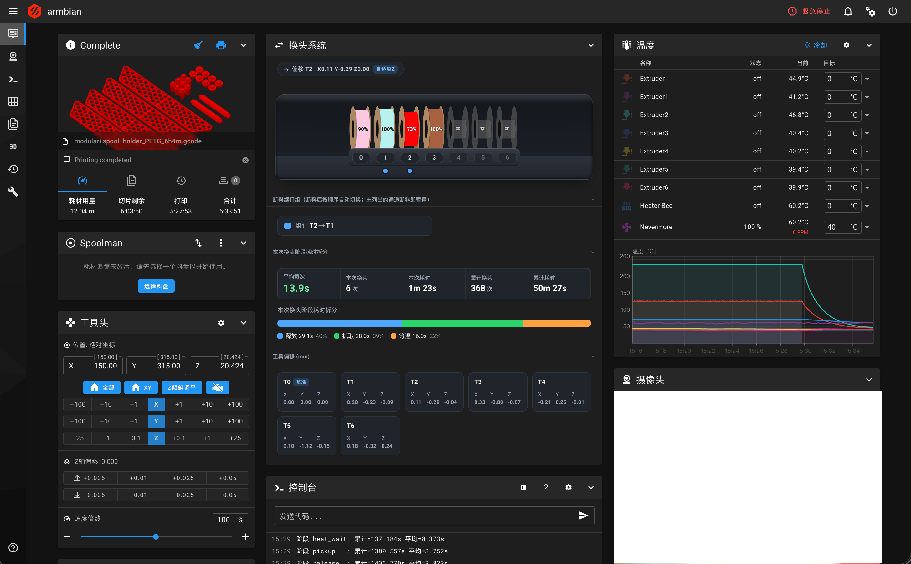

# klipper-toolchange-stats

这是一个 Klipper 多热端 / 多工具头换头插件。它负责注册 `T0`、`T1` 这类换头命令，并在换头时自动处理当前工具状态、偏移、温度等待、耗材检查、断料续打、换头统计等流程。

仓库已经内置编译好的 Mainsail 前端产物。通过安装脚本部署后，可以在 Mainsail 中直观看到多工具头状态、耗材状态和换头统计：

## 文档

- [Quick Start：从零到第一次安全换头](https://github.com/null01024/klipper-toolchange-stats/wiki/Quick-Start)
- [完整中文 Wiki](https://github.com/null01024/klipper-toolchange-stats/wiki)
- [配置参考](https://github.com/null01024/klipper-toolchange-stats/wiki/Configuration-Reference)
- [故障排查](https://github.com/null01024/klipper-toolchange-stats/wiki/Troubleshooting-Startup)

Wiki 提供从安装、机械换头、偏移校准、切片器配置到可选模块和故障恢复的完整教程。本 README 仅保留项目概览，安装、配置、校准和故障排查请以 Wiki 为准。

> 安装完成不代表机械换头已经安全。第一次移动前，请按照 Quick Start 在冷机、低速状态下检查释放和抓取动作，确认工具头不会发生碰撞后再开始打印。

## 适合谁使用

适合：

- Klipper 多热端机器。
- Klipper 多工具头机器。
- 希望用 `T0`、`T1`、`T2` 等命令切换工具。
- 希望把换头流程、偏移、耗材检测、断料续打、统计集中到插件里管理。

不适合：

- 普通单热端机器。
- 还没有完成基础 Klipper 配置、不能正常归零和加热的机器。

## 社区交流

欢迎加入 **3D打印多色技术交流群**，群号：`1106540104`。

  

## 许可证

本项目采用 [GNU General Public License v3.0](LICENSE)（`GPL-3.0-only`）发布。
