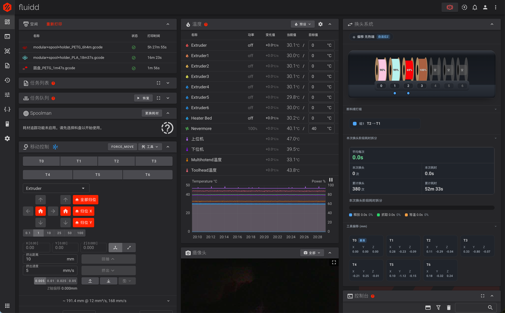

# klipper-toolchange-stats

这是一个 Klipper 多热端 / 多工具头换头插件。它负责注册 `T0`、`T1` 这类换头命令，并在换头时自动处理当前工具状态、偏移、温度等待、耗材检查、断料续打、换头统计等流程。

配合 [mainsail-toolchanger](https://github.com/null01024/mainsail-toolchanger) / [fluidd-toolchange](https://github.com/null01024/fluidd-toolchanger) 网页前端后，可以在 Mainsail / Fluidd 中直观看到多工具头状态、耗材状态和换头统计：




这份 README 面向第一次安装的用户，重点说明怎么安装、安装后要改哪些配置、怎么验证能不能正常工作。

## 适合谁使用

适合：

- Klipper 多热端机器。
- Klipper 多工具头机器。
- 希望用 `T0`、`T1`、`T2` 等命令切换工具。
- 希望把换头流程、偏移、耗材检测、断料续打、统计集中到插件里管理。

不适合：

- 普通单热端机器。
- 还没有完成基础 Klipper 配置、不能正常归零和加热的机器。

## Multitool 配置说明

安装脚本会把基础配置部署到 `~/printer_data/config/multitool/`。完整模板见
[`multitool_config.cfg`](multitool_config.cfg)，修改后需要重启 Klipper。

`[multitool]` 是必需的主模块；其余以 `multitool_` 开头的 section 都是可选
模块，只有写入配置后才会启用。使用前还需要：

- 配置 `[save_variables]`。主模块用它保存当前工具，偏移和统计模块也会用它
  保存数据。
- 实现 `[gcode_macro multitool_release_tool]` 和
  `[gcode_macro multitool_pickup_tool]`。模板中的默认实现只会报错，不会执行
  机械换头。
- 按 `T0 -> [extruder]`、`T1 -> [extruder1]`、`T2 -> [extruder2]` 的规则
  配置挤出机，并删除会与插件冲突的旧 `Tn`、`UNTOOL` 等换头宏。

### `[multitool]` 主模块

| 配置项 | 默认值 | 说明 |
| --- | --- | --- |
| `tool_count` | 必填 | 工具数量，整数 `1..16`；插件据此注册 `T0..T{n-1}`。 |
| `z_hop` | `0.4` | 每次换头前相对抬升的 Z 高度，单位 mm，必须 `>= 0`。 |
| `feed_z` | `600` | Z 抬升速度，单位 mm/min，整数且必须 `>= 1`。 |
| `accel_swap` | `8000` | 换头期间使用的加速度，单位 mm/s²，必须 `> 0`；结束后恢复原值。 |
| `untool_safe_z` | `10` | 当前无工具时，抓取第一个工具前移动到的绝对安全 Z，单位 mm，必须 `>= 0`。 |
| `untool_unhomed_prepare` | `True` | 执行 `UNTOOL` 且 XYZ 未全部归位时，先归位缺失的 XY，再临时设置 Z=0 并抬升 10 mm。 |
| `sync_active_spool` | `True` | 换头后同步 Spoolman 当前料盘；未配置 Moonraker Spoolman 时只会警告。 |
| `sync_active_extruder` | `True` | 换头时用 `ACTIVATE_EXTRUDER` 激活对应的 `[extruderN]`。关闭后也不会执行下面的运动队列同步。 |
| `sync_extruder_motion` | `True` | 将共享 E 步进的运动队列同步到当前工具；共用 E 步进时通常开启，独立 E 步进时设为 `False`。 |
| `extruder_motion_sync_stepper` | `extruder` | 共享 E 步进名称；`sync_extruder_motion: True` 时不能为空。 |
| `default_pressure_advance_extruder` | `extruder` | 未传 `EXTRUDER` 的 `SET_PRESSURE_ADVANCE` 默认作用目标；留空可关闭此覆写。 |
| `extrude_compensation_length` | `0` | 释放前回抽、抓取后挤出的补偿长度，单位 mm；`0` 表示关闭。 |
| `extrude_compensation_speed` | `1800` | 回抽和挤出补偿速度，单位 mm/min，必须 `> 0`。 |

补偿挤出只会在对应 `[extruderN]` 的当前温度达到 `min_extrude_temp` 时执行；
该值未配置时插件按 `170` °C 处理。Orca `lane_data` 同步目前固定启用，
没有 `sync_orca_lane_data` 配置项。

### `[multitool_clamp]` 夹紧检测（可选）

| 配置项 | 默认值 | 说明 |
| --- | --- | --- |
| `pin` | 必填 | 夹紧检测开关引脚；`PRESSED` 表示已夹紧，可用 `!`、`^`、`~` 修饰电平和上下拉。 |
| `settle_ms` | `50` | 每次校验前等待运动完成后的去抖时间，单位 ms，整数且必须 `>= 0`。 |

启用后，主模块会在换头入口、释放后和抓取后自动校验夹紧状态。

### `[multitool_filament]` 耗材检测与断料续打（可选）

该模块直接复用 `[multitool]` 的 `tool_count`，没有单独的通道数量配置。

| 配置项 | 默认值 | 说明 |
| --- | --- | --- |
| `pin_0..pin_{n-1}` | 全部必填 | 每个工具对应的耗材检测引脚；`PRESSED` 表示已装料，可使用 `!`、`^`、`~` 修饰符。 |
| `boot_grace_s` | `5` | 启动后等待传感器状态上报的时间，单位 s，必须 `>= 0`；超时仍未上报的通道按无料处理。 |
| `runout_event_delay` | `3` | 一次断料处理后的事件去抖时间，单位 s，必须 `>= 0`。 |
| `continuation_groups` | 空 | 有序续打组，例如 `[0,1],[2,3]`。编号必须在工具范围内，同一工具不能出现在多个组中；留空时断料只提示状态，不自动暂停或续打。 |
| `runout_continue_length` | `0` | 检测到断料后继续消耗的净送料长度，单位 mm，必须 `>= 0`；`0` 表示立即处理。 |
| `runout_continue_poll_s` | `0.3` | 延后续打期间检查送料长度的间隔，单位 s，必须 `>= 0.05`。 |

以下示例假设 `tool_count: 4`：

```ini
[multitool_filament]
continuation_groups: [0,1],[2,3]
runout_continue_length: 50
pin_0: ^multihotend:IO0
pin_1: ^multihotend:IO1
pin_2: ^multihotend:IO2
pin_3: ^multihotend:IO3
```

自动断料处理仅在配置了 `continuation_groups`、当前处于 `printing` 状态且
断料通道是当前工具时触发；用于续打的 `PAUSE` 和 `RESUME` 宏必须可用。
即使没有配置续打组，换头前的无料检查仍然有效。

### `[multitool_offsets]` 工具偏移（可选）

| 配置项 | 默认值 | 说明 |
| --- | --- | --- |
| `z_offset_adaptive` | `False` | 开启后，每次打印的首个工具自动成为 Z 基准，其他工具应用相对该基准的 Z 差值；关闭时直接应用保存的 XYZ 偏移。 |
| `save_prefix` | `t` | 偏移变量前缀；默认读取 `t0_offset_x`、`t0_offset_y`、`t0_offset_z` 等变量。 |

偏移值保存在 `[save_variables]` 中。若同时使用 `[multitool_touch_z]`，两个
模块的 `save_prefix` 应保持一致。

### `[multitool_stats]` 换头统计（可选）

| 配置项 | 默认值 | 说明 |
| --- | --- | --- |
| `persist_keys_prefix` | `tc_total_` | 历史统计变量前缀；修改后会使用一组新的持久化键。 |
| `boot_banner_delay_s` | `5.0` | 启动后显示历史统计摘要的延迟，单位 s，必须 `>= 0`；设为 `0` 不显示启动摘要。 |

统计模块自动记录释放、抓取和等温耗时，并在成功换头后写入
`[save_variables]`，不需要额外的 G-code 命令。

### `[multitool_touch_z]` 接触式 Z 校准（可选）

该模块可使用独立触发引脚，也可复用 `[stepper_z]` 的 `endstop_pin`，不占用
Klipper 的 `[probe]`。

| 配置项 | 默认值 | 说明 |
| --- | --- | --- |
| `use_z_endstop` | `False` | 设为 `True` 时复用 `[stepper_z] endstop_pin`，并忽略独立 `pin`。 |
| `pin` | 条件必填 | 独立接触传感器引脚；`use_z_endstop: False` 时必须配置。 |
| `save_prefix` | `t` | 保存 Z 偏移的变量前缀，例如 `t1_offset_z`。 |
| `base_tool` | `0` | 相对 Z 偏移的基准工具编号，整数且必须 `>= 0`；必须先校准基准工具。 |
| `speed` | `2.0` | 向下探测速度，单位 mm/s，必须 `> 0`。 |
| `lift_speed` | `5.0` | 采样回撤和最终抬升速度，单位 mm/s，必须 `> 0`。 |
| `sample_retract_dist` | `2.0` | 两次采样之间的回撤距离，单位 mm，必须 `>= 0`。 |
| `samples` | `3` | 每轮采样次数，整数 `1..20`。 |
| `samples_result` | `median` | 采样结果算法，可选 `median` 或 `average`。 |
| `samples_tolerance` | `0.05` | 同一轮采样允许的最大极差，单位 mm，必须 `>= 0`。 |
| `samples_tolerance_retries` | `3` | 超出容差后的整轮重试次数，整数 `0..20`。 |
| `probe_depth` | `5.0` | 每次最多向下探测的距离，单位 mm，必须 `> 0`。 |
| `final_lift_z` | `2.0` | 探测完成后的相对抬升距离，单位 mm，必须 `>= 0`。 |
| `clear_xy_offset` | `False` | 校准前是否同时清除 XY 偏移；关闭时只清除 Z 偏移。 |
| `calibration_x` / `calibration_y` | 未设置 | 自动工具校准点的 XY 坐标；执行 `TOUCH_Z_CALIBRATE_TOOL` 时两项都必须配置。 |
| `calibration_z` | `0.0` | 校准点的预期触发 Z，用于计算探测起始高度。 |
| `calibration_clearance` | `sample_retract_dist` | 探测起点高于 `calibration_z` 的距离，单位 mm，必须 `>= 0`；自动工具校准时还必须小于 `probe_depth`。 |
| `calibration_travel_speed` | `100.0` | 移动到校准点的 XY 速度，单位 mm/s，必须 `> 0`。 |
| `calibration_z_speed` | `lift_speed` | 移动到探测起始 Z 的速度，单位 mm/s，必须 `> 0`。 |

独立触发引脚示例：

```ini
[multitool_touch_z]
pin: ^multihotend:IO4
calibration_x: 112.5
calibration_y: -4
```

复用 Z 限位时将上例的 `pin` 换成：

```ini
use_z_endstop: True
```

## 许可证

本项目采用 [GNU General Public License v3.0](LICENSE)（`GPL-3.0-only`）发布。
